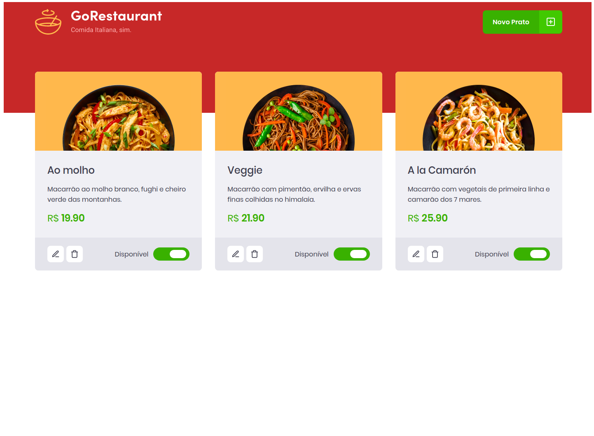

<h2 align="center">
🍕 GoRestaurant
</h2>


<br>

<p align="center" >

Um desafio do Bootcamp Ignite com o objetivo de treinar a escrita e o entendimento na hora da contrução de uma aplicação React com TypeScript e Componentes Funcionais! **-**  Desafio 4 do Bootcamp Ignite [ Trilha React.js ] 
</p>
<br>

## 📷 Imagen da aplicação



## 🚀 Como executar o projeto

### Pré-requisitos

Antes de começar, você vai precisar ter instalado em sua máquina as seguintes ferramentas: [Git](https://git-scm.com), [Node.js](https://nodejs.org/en/).

---
<br>

### 🧭 Rodando o server

```bash
# Clone este repositório
$ git clone https://github.com/nicolasteofilo/GoRestaurant

# Acesse a pasta do projeto no seu terminal/cmd
$ cd GoRestaurant

# Instale as dependências
$ yarn # ou npm install

# Execute o server
$ yarn server # ou npm run server

# O server estará rodando na porta:3333 - acesse http://localhost:3333
```

<br>

### 💻 Rodando a aplicação

PS: execute a aplicação em outro aba de terminal ( deixe em paralelo rodando o server )

```bash
# Execute a aplicação em modo de desenvolvimento
$ yarn dev # ou npm run dev

# A aplicação será aberta na porta:3000 - acesse http://localhost:3000
```

---

<br>

## ⚒️ **Tecnologias**

As seguintes ferramentas foram usadas na construção do projeto:

- **[React](https://reactjs.org/)**
- **[Typescript](https://www.typescriptlang.org/)**
- **[Babel](https://babeljs.io/)**
- **[Webpack](https://webpack.js.org/)**
- **[Axios](https://github.com/axios/axios)**
- **[react-icons](https://react-icons.github.io/react-icons/)**
- **[styled-components](https://styled-components.com/)**

Feito por [Nicolas Teófilo](https://linkedin.com/in/nicolasteofilo)
